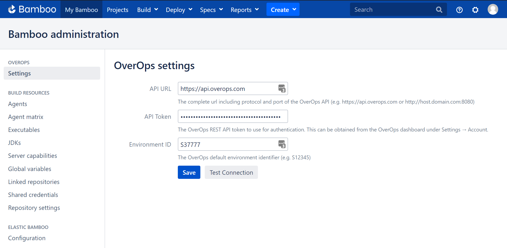
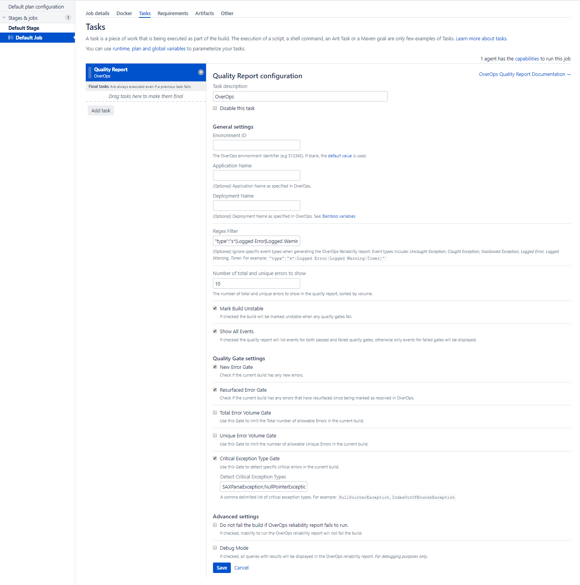

# Bamboo OverOps Quality Gates Plugin

 ##### 1. Install Atlassian SDK
 * Mac OS (HomeBrew)
    1. Open a Terminal window and add the Atlassian "Tap" to your Brew using the command:
    <br />`brew tap atlassian/tap`
    2. Then install the SDK using the atlassian/tap command:
    <br />`brew install atlassian/tap/atlassian-plugin-sdk`
    3. [Next: Verify that you have set up the SDK correctly](https://developer.atlassian.com/display/DOCS/Install+the+Atlassian+SDK+on+a+Linux+or+Mac+system#InstalltheAtlassianSDKonaLinuxorMacsystem-step3Step3:VerifythatyouhavesetuptheSDKcorrectly)
 
 * Debian, Ubuntu Linux
    1. First, set up the Atlassian SDK repositories:
    <br /> `sudo sh -c 'echo "deb https://packages.atlassian.com/debian/atlassian-sdk-deb/ stable contrib" >>/etc/apt/sources.list'`
    2. Download the public key using curl or wget:
    <br /> `wget https://packages.atlassian.com/api/gpg/key/public`
    3. Add the public key to apt to verify the package signatures automatically:
    <br /> `sudo apt-key add public   ` 
    4. Then, run the install:
    <br /> `sudo apt-get update`
    <br /> `sudo apt-get install atlassian-plugin-sdk`
    6. [Next: Verify that you have set up the SDK correctly](https://developer.atlassian.com/display/DOCS/Install+the+Atlassian+SDK+on+a+Linux+or+Mac+system#InstalltheAtlassianSDKonaLinuxorMacsystem-step3Step3:VerifythatyouhavesetuptheSDKcorrectly)
    
 * Red Hat Enterprise Linux, CentOS, Fedora (RPM)
    
    To install on systems that use the Yum package manager:
    
    1. Create the repo file in your /etc/yum.repos.d/ folder:
    <br />`sudo vi /etc/yum.repos.d/artifactory.repo`
    2. Configure the repository details:
    <br /> `[Artifactory]`
    <br /> `name=Artifactory`
    <br /> `baseurl=https://packages.atlassian.com/yum/atlassian-sdk-rpm/`
    <br /> `enabled=1`
    <br /> `gpgcheck=0`
    3. Install the SDK:
    <br /> `sudo yum clean all`
    <br /> `sudo yum updateinfo metadata`
    <br /> `sudo yum install atlassian-plugin-sdk`
    4. [Next: Verify that you have set up the SDK correctly](https://developer.atlassian.com/display/DOCS/Install+the+Atlassian+SDK+on+a+Linux+or+Mac+system#InstalltheAtlassianSDKonaLinuxorMacsystem-step3Step3:VerifythatyouhavesetuptheSDKcorrectly)
    
 * .tgz File
    1. [Download a TGZ (GZipped tar file) of the SDK](https://marketplace.atlassian.com/download/plugins/atlassian-plugin-sdk-tgz?_ga=2.135130865.1342090517.1563909899-484610990.1554922063)
    2. Locate the downloaded SDK file. 
    3. Extract the file to your local directory. 
    <br /> `sudo tar -xvzf atlassian-plugin-sdk-4.0.tar.gz -C /opt` 
    4. Rename the extracted folder to  atlassian-plugin-sdk .
    <br /> `sudo mv /opt/atlassian-plugin-sdk-4.0 /opt/atlassian-plugin-sdk `
    5. [Next: Verify that you have set up the SDK correctly](https://developer.atlassian.com/display/DOCS/Install+the+Atlassian+SDK+on+a+Linux+or+Mac+system#InstalltheAtlassianSDKonaLinuxorMacsystem-step3Step3:VerifythatyouhavesetuptheSDKcorrectly)
    
 ##### 2. Verify that you have set up the SDK correctly
 * Open a terminal window and run the following command:
 <br /> `atlas-version`
 <br /> `ATLAS Version:    6.2.9`
 <br /> `ATLAS Home:       /usr/local/Cellar/atlassian-plugin-sdk/6.2.4/libexec`
 <br /> `ATLAS Scripts:    /usr/local/Cellar/atlassian-plugin-sdk/6.2.4/libexec/bin`
 <br /> `ATLAS Maven Home: /usr/local/Cellar/atlassian-plugin-sdk/6.2.4/libexec/apache-maven-3.2.1`
 <br /> `AMPS Version:     6.2.6`
 <br /> `--------`
 <br /> `Executing: /usr/local/Cellar/atlassian-plugin-sdk/6.2.4/libexec/apache-maven-3.2.1/bin/mvn --version -gs /usr/local/Cellar/atlassian-plugin-sdk/6.2.4/libexec/apache-maven-3.2.1/conf/settings.xml`
 <br /> `Java HotSpot(TM) 64-Bit Server VM warning: ignoring option MaxPermSize=256M; support was removed in 8.0`
 <br /> `Apache Maven 3.2.1 (ea8b2b07643dbb1b84b6d16e1f08391b666bc1e9; 2014-02-15T04:37:52+10:00)`
 <br /> `Maven home: /usr/local/Cellar/atlassian-plugin-sdk/6.2.4/libexec/apache-maven-3.2.1`
 <br /> `Java version: 1.8.0_45, vendor: Oracle Corporation`
 <br /> `Java home: /Library/Java/JavaVirtualMachines/jdk1.8.0_45.jdk/Contents/Home/jre`
 <br /> `Default locale: en_US, platform encoding: UTF-8`
 <br /> `OS name: "mac os x", version: "10.11.6", arch: "x86_64", family: "mac"`
 
 ##### 3. NOTICE
 * in the future use [`atlas-mvn`](https://developer.atlassian.com/server/framework/atlassian-sdk/atlas-mvn/) instead of `mvn`
 <br /> `atlas-mvn [options]`
 <br /> `atlas-mvn -help`
 <br /> `atlas-mvn clean package`
 
 ## Setup Bamboo OverOps Quality Gates Plugin
 ### 1. Global Configuration

        
##### OverOps URL

The complete URL of the OverOps API, including port. https://api.overops.com for SaaS or http://host.domain.com:8080 for on prem.

##### OverOps Environment ID

The default OverOps environment identifier (e.g. S12345) if none is specified in the build settings. Make sure the "S" is capitalized.

##### OverOps API Token

The OverOps REST API token to use for authentication. This can be obtained from the OverOps dashboard under Settings &rarr; Account.
 ### 2. Setup build step


#### Application Name

**Example:** ${bamboo.shortJobName}

*(Optional)* [Application Name](https://doc.overops.com/docs/naming-your-application-server-deployment) as specified in OverOps

* If populated, the plugin will filter the data for the specific application in OverOps.
* If blank, no application filter will be applied in query.

#### Deployment Name

**Example:** ${bamboo.buildNumber} or ${bamboo.planName}-${bamboo.buildNumber}

*(Optional)* [Deployment Name](https://doc.overops.com/docs/naming-your-application-server-deployment) as specified in OverOps or use Jenkins environment variables.

* If populated, the plugin will filter the data for the specific deployment name in OverOps
* If blank, no deployment filter will be applied in the query.

#### Environment ID

The OverOps environment identifier (e.g S4567) to inspect data for this build. If no value is provided here, the value provided in the global Jenkins plugin settings will be used.

#### Regex Filter

A way to filter out specific event types from affecting the outcome of the OverOps Reliability report.

* Sample list of event types, Uncaught Exception, Caught Exception,|Swallowed Exception, Logged Error, Logged Warning, Timer
* This filter enables the removal of one or more of these event types from the final results.
* Example filter expression with pipe separated list- ```"type":\"s*(Logged Error|Logged Warning|Timer)```

#### Mark Build Unstable

If checked the build will be marked unstable if any of the above gates are met.

#### Show Top Issues

Prints the top X events (as provided by this parameter) with the highest volume of errors detected in the current build. This is used in conjunction with Max Error Volume and Unique Error Volume to identify the errors which caused a build to fail.

#### New Error Gate

Detect all new errors in the build. If found, the build will be marked as unstable.

#### Resurfaced Error Gate

Detect all resurfaced errors in the build. If found, the build will be marked as unstable.

#### Total Error Volume Gate

Set the max total error volume allowed. If exceeded the build will be marked as unstable.

#### Unique Error Volume Gate

Set the max unique error volume allowed. If exceeded the build will be marked as unstable.

#### Critical Exception Type Gate

A comma delimited list of exception types that are deemed as severe regardless of their volume. If any events of any exceptions listed have a count greater than zero, the build will be marked as unstable.

**Example:**  
NullPointerException,IndexOutOfBoundsException

#### Increasing Errors Gate

**Combines the following parameters:**

* Event Volume Threshold
* Event Rate Threshold
* Regression Delta
* Critical Regression Threshold
* Apply Seasonality

##### Active Time Window (d - day, h - hour, m - minute)

The time window inspected to search for new issues and regressions. To compare the current build with a baseline time window, leave the value at zero.

* **Example:** 1d would be one day active time window.

##### Baseline Time Window  (d - day, h - hour, m - minute)

The time window against which events in the active window are compared to test for regressions. For using the Increasing Error Gate, a baseline time window is required

* **Example:** 14d would be a two week baseline time window.

##### Event Volume Threshold

The minimal number of times an event of a non-critical type (e.g. uncaught) must take place to be considered severe.

* If a New event has a count greater than the set value, it will be evaluated as severe and could break the build if its event rate is above the Event Rate Threshold.
* If an Existing event has a count greater than the set value, it will be evaluated as severe and could break the build if its event rate is above the Event Rate Threshold and the Critical Regression Threshold.
* If any event has a count less than the set value, it will not be evaluated as severe and will not break the build.

##### Event Rate Threshold (0-1)

The minimum rate at which event of a non-critical type (e.g. uncaught) must take place to be considered severe. A rate of 0.1 means the events is allowed to take place <= 10% of the time.

* If a New event has a rate greater than the set value, it will be evaluated as severe and could break the build if its event volume is above the Event Volume Threshold.
* If an Existing event has a rate greater than the set value, it will be evaluated as severe and could break the build if its event volume is above the Event Volume Threshold and the Critical Regression Threshold.
* If an event has a rate less than the set value, it will not be evaluated as severe and will not break the build.

##### Regression Delta (0-1)

The change in percentage between an event's rate in the active time span compared to the baseline to be considered a regression. The active time span is the Active Time Window or the Deployment Name (whichever is populated). A rate of 0.1 means the events is allowed to take place <= 10% of the time.

* If an Existing event has an error rate delta (active window compared to baseline) greater than the set value, it will be marked as a regression, but will not break the build.

##### Critical Regression Threshold (0-1)

The change in percentage between an event's rate in the active time span compared to the baseline to be considered a critical regression. The active time span is the Active Time Window or the Deployment Name (whichever is populated). A rate of 0.1 means the events is allowed to take place <= 10% of the time.

* If an Existing event has an error rate delta (active window compared to baseline) greater than the set value, it will be marked as a severe regression and will break the build.

##### Apply Seasonality

If peaks have been seen in baseline window, then this would be considered normal and not a regression. Should the plugin identify an equal or matching peak in the baseline time window, or two peaks of greater than 50% of the volume seen in the active window, the event will not be marked as a regression.

#### Debug Mode

If checked, all queries and results will be displayed in the OverOps reliability report. For debugging purposes only.


#### Parameters

All parameters are optional.

| Parameter | Type | Default Value |
|---------|------|---------------|
| [`applicationName`](#application-name) | String | `null` |
| [`deploymentName`](#deployment-name) | String | `null` |
| [`serviceId`](#environment-id) | String | `null` |
| [`regexFilter`](#regex-filter) | String | `null` |
| [`markUnstable`](#mark-build-unstable) | boolean | `false` |
| [`printTopIssues`](#show-top-issues) | Integer | `5` |
| [`newEvents`](#new-error-gate) | boolean | `false` |
| [`resurfacedErrors`](#resurfaced-error-gate) | boolean | `false` |
| [`maxErrorVolume`](#total-error-volume-gate) | Integer | `0` |
| [`maxUniqueErrors`](#unique-error-volume-gate) | Integer | `0` |
|[`criticalExceptionTypes`](#critical-exception-type-gate) | String | `null` |
| [`activeTimespan`](#active-time-window-d---day-h---hour-m---minute) | String | `null` |
| [`baselineTimespan`](#baseline-time-window--d---day-h---hour-m---minute) | String | `null` |
| [`minVolumeThreshold`](#event-volume-threshold) | Integer | `0` |
| [`minErrorRateThreshold`](#event-rate-threshold-0-1) | Double | `0` |
| [`regressionDelta`](#regression-delta-0-1) | Double | `0` |
| [`criticalRegressionDelta`](#critical-regression-threshold-0-1) | Double | `0` |
| [`applySeasonality`](#apply-seasonality) | boolean | `false` |
| [`debug`](#debug-mode) | boolean | `false` |
